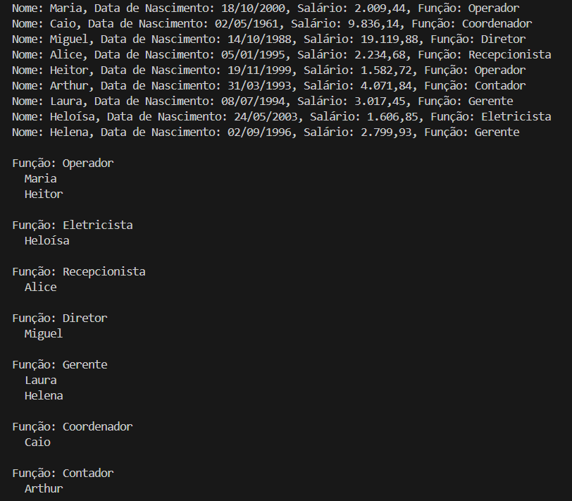

# Controle de Funcionários

Este é um projeto em Java puro que realiza a gestão de uma lista de funcionários com diversas operações, como aumento de salário, ordenação, agrupamento por função, cálculo de aniversariantes, entre outras.

## 📸 Demonstração



## Funcionalidades

- Cadastro inicial de 10 funcionários
- Remoção de funcionário por nome
- Impressão detalhada dos funcionários
- Aumento de 10% nos salários
- Agrupamento dos funcionários por função
- Listagem de aniversariantes nos meses de Outubro e Dezembro
- Identificação do funcionário mais velho
- Ordenação alfabética dos nomes
- Cálculo do total dos salários
- Cálculo de quantos salários mínimos cada funcionário recebe

## Tecnologias

- Java 8+
- API de datas (`java.time`)
- `BigDecimal` para cálculos de precisão
- `Stream API` para manipulação de coleções

## Como executar

1. Clone o repositório:
   ```bash
   git clone https://github.com/IgorBarcelo/controle-funcionarios.git
   cd controle-funcionarios
   ```

2. Compile o projeto:
   ```bash
   javac Principal.java Funcionario.java
   ```

3. Execute o projeto:
   ```bash
   java Principal
   ```

## Estrutura dos arquivos

```
controle-funcionarios/
├── Funcionario.java
├── Principal.java
└── README.md
```

## Créditos
Desenvolvido por [Igor Barcelo](https://www.linkedin.com/in/igor-barcelo-631010216/)